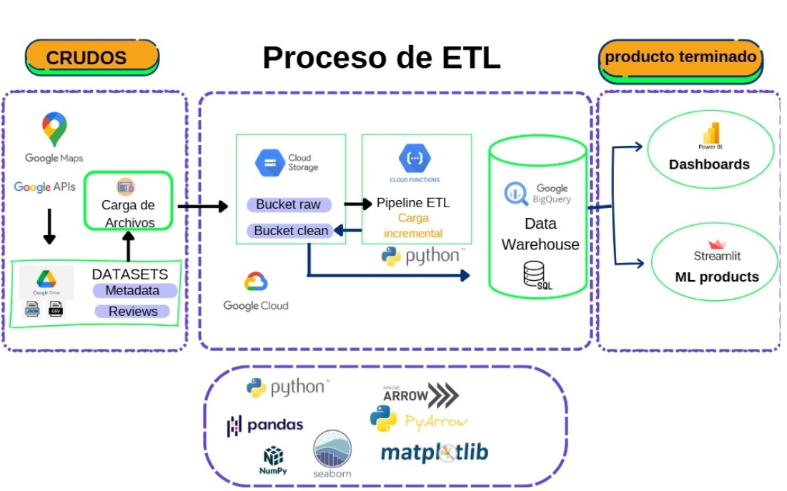
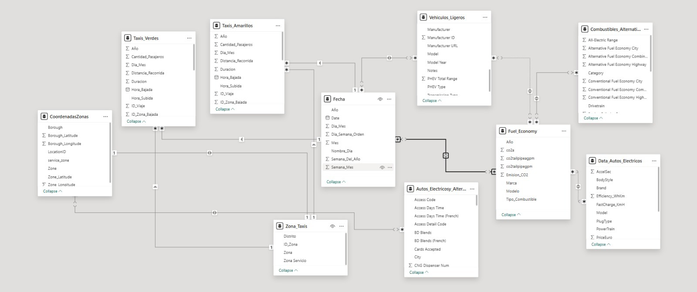

<div style="position: relative; height: 300px;">
  <!-- Imagen inferior derecha -->
  
  <!-- Imagen inferior izquierda (20% más grande) -->
  
</div>


# Demo 1. Presentación y propuesta de trabajo en base al negocio.
## Introducción
Somos una consultora de Data Science enfocada en el análisis estadístico de datos, desarrollo de modelos de machine learning y visualizaciones gráficas.

Consultora data se enfoca en establecer objetivos de negocios para obtener así estrategias que promuevan la optimización de rendimientos a corto, mediano y largo plazo, como también mostrar propuestas de mejora mediante el uso de modelos predictivos y visualizaciones. 

Nuestra consultora cuenta con un board, el cual está encargado de abordar los proyectos y negocios. 

Para garantizar la excelencia en nuestros servicios, nuestro equipo está compuesto por especialistas con roles claramente definidos, que abordarán los objetivos propuestos por la empresa:
- Analista de Datos: Julian Ariel Burastero, Francisco Fajardo
Responsable de la limpieza, integración y preprocesamiento de datasets.
- Especialista en Visualización de Datos: Julian Ariel Burastero,
Diseña dashboards interactivos, mapas de calor y gráficos que transforman datos complejos en información comprensible para los clientes.
- Ingeniero de Machine Learning: Gabriel Arturo Monzon Luna, Jerónimo Martinez
Desarrolla modelos predictivos y optimiza algoritmos para correlaciones clave 
- Data Engineer: Ivan Lopez-Francisco Fajardo
Diseñar, desarrollar y mantener sistemas que procesan grandes cantidades de datos (Big Data), a través de base de datos relacionales y no relacionales, o en la nube.
- Gerente de Proyecto: Jerónimo Martinez
Coordina las tareas del equipo, gestiona los entregables y asegura 
la alineación con los objetivos del cliente.

## Contexto del negocio
Taxicom 2.0 es una empresa de taxis estadounidense que quiere expandir su negocio en la ciudad de New York para el segundo semestre de 2025. La empresa es consciente de que la tecnología y la ciencia de datos es crucial para la supervivencia y éxito de dicho proyecto frente a la competencia y las demandas sociales. Para ello Taxicom 2.0 decide contratar a nuestra consultora a fin de emplear nuestros servicios en base a sus objetivos. 

- Objetivos de negocio
Optimizar la logística y operación del transporte mediante análisis detallado de patrones de movilidad.
Evaluar el impacto ambiental del transporte y proponer soluciones hacia una transición sostenible.
Mejorar la experiencia del cliente identificando puntos críticos como tiempo, costo, y satisfacción (propinas).
Generar estrategias económicas basadas en la elasticidad de demanda, precios y eficiencia operativa.
- Servicios requeridos de la empresa TaxiCom 2.0

La empresa Taxicom 2.0 se dispone a contratar un conjunto de servicios personalizados en base a sus objetivos:  

+ Análisis de Demanda y Logística:
	- Identificación de zonas y horarios de alta demanda.
	- Optimización de rutas basadas en patrones de congestión y tiempo promedio de viaje.
	- Mapas dinámicos para la planificación de horarios pico.
+ Monitoreo de Impacto Ambiental:
	- Modelos predictivos que correlacionen calidad del aire (AQI) con cantidad de viajes.
	- Evaluación de la transición a vehículos eléctricos comparando emisiones y costos operativos.
+ Estudios de Satisfacción del Cliente:
	- Análisis de propinas promedio por zona como indicador de calidad.
	- Propuestas para implementar soluciones tecnológicas (pagos digitales, apps).

## Análisis Exploratorio de los datos (EDA)

El EDA se realizó en base a los dataset provistos por la empresa y en base a los que visualizamos como relevantes para el negocio. Cada link que se ve a continuación abre el EDA de cada data set trabajado y analizado:
- AlternativeFuelVehicleUS
- Air_quality.csv
- sensores 22-24.csv
- ElectricCarData_Norm
- FuelEconomy
- Lighr duty vehicles
- taxis_amarillos
- taxis_verdes
- Zonastaxi

## KPI propuestos a la empresa

Un KPI es un indicador clave de desempeño, es decir, es una métrica utilizada para medir y evaluar el rendimiento de una actividad, proceso o estrategia en relación con un objetivo específico en el tiempo. En base a estos indicadores la empresa puede tomar decisiones y monitorear los procesos. 

1. Inclusión de autos eléctricos. 
El KPI en este caso mide el progreso en la inclusión de autos eléctricos en función de un objetivo predeterminado (por defecto, 1000 autos). El cálculo genera un porcentaje que permite visualizar cuánto se ha avanzado hacia la meta.

	- Fórmula del KPI para el cliente:
	Progreso de Inclusión (%) = (Número de autos eléctricos integrados/ objetivo total de autos eléctricos) x 100

	- Explicación para el cliente:
	Número de autos eléctricos integrados: Es el número actual de autos eléctricos incorporados en la flota.
	Objetivo total de autos eléctricos: Es la meta establecida para integrar autos eléctricos, por defecto 1000.
	El resultado se expresa en porcentaje, mostrando cuánto se ha avanzado hacia el objetivo.

2. Reducir las Emisiones de CO2 en un 10%
Este KPI mide el progreso hacia el objetivo de reducir las emisiones de CO2 en un 10% respecto a su valor inicial. Permite evaluar si las estrategias implementadas para reducir emisiones son efectivas y cuán cerca estamos de alcanzar la meta.

	- Fórmula para el cliente:
	Reducción de CO2 (%) =  (Emisiones iniciales - Emisiones actuales/emisiones iniciales) x 100

	- Componentes de la Fórmula:
	Emisiones iniciales: El nivel de emisiones de CO2 antes de implementar las estrategias de reducción.
	Emisiones actuales: El nivel de emisiones de CO2 después de implementar las estrategias.
	El resultado expresa el porcentaje de reducción logrado respecto al valor inicial.

3. Reducción de Tiempo Muerto (%)
Este KPI mide el progreso en la reducción del tiempo muerto (o inactivo) de los taxis, es decir, el tiempo que pasan sin pasajeros mientras esperan una solicitud. Es clave para optimizar la operación y la rentabilidad del servicio, así como para disminuir el impacto ambiental.

	- Fórmula para el cliente:
	Reducción de tiempo muerto = (Tiempo muerto inicial- Tiempo muerto actual / Tiempo muerto inicial) x 100

	- Componentes de la Fórmula:
	Tiempo muerto inicial: El tiempo promedio que los taxis pasan inactivos por turno antes de implementar mejoras (en minutos u horas).
	Tiempo muerto actual: El tiempo promedio que los taxis pasan inactivos por turno después de implementar mejoras.
	Resultado: Indica en porcentaje cuánto se ha reducido el tiempo muerto respecto al punto de partida.

4. Aumentar los ingresos de pasajeros en un 2% de taxis amarillos
Objetivo: Incrementar los ingresos totales generados por los viajes en un 2% en el próximo trimestre.

	- Fórmula:  (Ingresos actuales - Ingresos previos / Ingresos previos) × 100 

	- Medición:
	Ingresos actuales: Total de la columna total_amount para el período actual.
	Ingresos previos: Total de la columna total_amount para el período de comparación (mes o trimestre anterior).

5. Reducir la duración promedio de los viajes en un 5% de taxis amarillos
Objetivo: Disminuir la duración promedio de los trayectos para mejorar la eficiencia operativa y reducir el tiempo muerto.

	- Fórmula:(Duración previa - Duración actual) / Duracioón previa×100

	- Medición:
	Duración promedio previa: Promedio de la diferencia entre tpep_pickup_datetime y tpep_dropoff_datetime para el período anterior.
	Duración promedio actual: Promedio de la misma métrica para el período actual.


6. Incrementar la ocupación promedio de pasajeros en un 3% de taxis amarillos
Objetivo: Aumentar el número promedio de pasajeros por viaje en un 3% para maximizar la capacidad utilizada.

	- Fórmula:(Ocupación actual - Ocupación previa) / Ocupación previa×100

	- Medición:
		Ocupación promedio actual: Promedio de la columna passenger_count en el período actual.
		Ocupación promedio previa: Promedio de la misma columna en el período anterior.


## Entregables

La consultora se prone entregar a Taxicom los siguientes servicios
- Carga incremental de datos en la nube de Google (Google cloud). 
- Dashboard interactivo con metricas y gráficos: KPI y los resultados obtenidos mediante la aplicaciónmachine learning.
- APIs: Sistemas de recomendación de zonas para taxis en base a la demanda de clientes.  


# Demo 2. Carga de los datos  en la nube y posibles implementaciones de Machine learning y visualización. 

Esta segunda reunión con nuestro cliente Taxicom 2.0 tiene el objetivo de mostrar:
1. Los avances en cuanto a la extracción, tranformación y carga (ETL) de los datos (Video).
	- Interfaz de carga para el usuario
	- Carga de los mismos datos a la nube (Google Cloud)
	- Tratamiento de los datos: tranformaciones.
	- Posible carga incremental de datos. 
	- Datos preparados para implementaciones.
2. Muestra de la posible Implementación de Machine learning en los datos desde Big Query: Propuestas de modelos 
3. Esbozo de la visualización o Dashboard.  	


## Extracción,tranformación y carga de datos



En esta primera parte veremos el ciclo de vida del dato. Explicación de los pasos en el VIDEO:  

https://www.youtube.com/watch?v=PlCpHxi0iw0

- Fuente de los datos: Se obtiene el dato directamente del cliente en formato CSV o Parquet
	- Interfaz para carga de datos.(Se explica en el siguiente subtítulo)
	- Extracción: La extraccion se basa principalmente con un bucket utilizado en Google Cloud.
	- Extrae directamente al bucket creado.
	- Extrae con nombre de archivo original.
- Verificación: Nuestra función solo procesa archivos con las extensiones .csv, .xlsx (Excel), o .parquet, si el archivo tiene otro formato, se detiene el proceso.
- Creación de carpeta temporal: El archivo se descarga desde el bucket y se guarda temporalmente en la carpeta /tmp del entorno de la Cloud Function.
- Lectura del archivo: Mediante la libreria de pandas se procede asignar un dataframe al archivo abierto.
- Tranformación de los datos: 
	- Normalizacion de nombres de columnas
	- Se eliminan espacios y se convierten los nombres de columnas a minúsculas para estandarizar.
	- Manejo de valores inválidos
	- Datos categoricos: Se eliminan caracteres no imprimibles y se rellenan valores faltantes con "N/A".
	- Datos numericos: Enteros (int) y flotantes (float): Se convierten valores no válidos a NaN o 0 y se rellenan según corresponda.
	- Guardado de archivo transformado: Se guarda el DataFrame transformado en un archivo temporal (en este punto se incorpora un codigo que trasnforme cualquier caracter no imprimible en el nombre del archivo para evtar cualquier inconveniente en la futura creacion de tablas en Big Querry).
- Subida de archivo transformado a GCS
	- El archivo transformado se sube al bucket en una carpeta llamada transformed/.
- Carga de datos en BigQuery
	- Configuracion de BigQuery
	- Se configura un dataset y una tabla en BigQuery. El dataset se basa en el nombre del archivo (De igual manera se ingresa un parametro que reemplace cualquier caracter no imprimible para evitar problemas en la creacion del dataset y tabla).
	- Creacion del dataset si no existe
	- Crea el dataset en el servicio de Big Querry de Google Cloud basado en el nombre del archivo original en caso de que no exista.
- Definicion de esquema y cargar datos
	- Se crean columnas y filas dependiendo de la estructura de los datos del dataset
	- Eliminar archivos temporales
	- Con cada proceso se elimina la carpeta /temp. del entorno de Google Cloud.
- Finalización: Si el evento se finaliza correctamente el entorno devuelve el print ("Proceso ETL completado exitosamente.") garantizando el ETL y la devolucion de tablas en Big Querry, lo que a su vez nos sirve como verificacion y validacion del proceso.
- Carga incremental: para el proceso de  carga incremental se uso una funcion llamada  calculate_file_hash, que se usa para detectar archivos unicos y evitar duplicados; el algoritmo que se uso en la funcion fue SHA256 que verifica la integradad de los dato en 256 bits.

### Interfaz Web para Subida de Archivos a Google Cloud

Esta interfaz para subir archivos es una solución secundaria y de manera local para opearaciones manuales. La carga automatica se plantea más adelante. 

1. Descripción General: Este proyecto implementa una interfaz web utilizando *Flask* para facilitar la subida de archivos a Google Cloud Storage. Su propósito es ofrecer un sistema sencillo y accesible para que el cliente pueda cargar datos desde un medio local, automatizando la conexión con Google Cloud y la ejecución de un proceso ETL (Extract, Transform, Load).
2. Características Principales
	- Interfaz de Usuario Intuitiva: Permite a los usuarios cargar archivos locales de manera sencilla desde un navegador web.
	- Conexión con Google Cloud Storage: La aplicación se conecta con un bucket específico de Google Cloud para almacenar los archivos subidos.
	- Ejecución Automática de Función ETL: Tras subir el archivo, se ejecuta un proceso ETL que permite procesar, transformar y cargar los datos según los requerimientos.
	- Validación y Notificación al Usuario: Al completar la subida, la aplicación confirma que el archivo fue subido correctamente y muestra una notificación para validar el éxito del proceso.
3. Requisitos
	- *Python 3.11 o superior*
	- *Flask*
	- *Google Cloud SDK* y librerías relacionadas
	- *Credenciales JSON* para la autenticación en Google Cloud
4. Instrucciones de Uso
	1. Configuración del Entorno
	- Instala las dependencias necesarias:bash; pip install -r requirements.txt
	-  Configura las credenciales de Google Cloud estableciendo la variable de entorno: bash; export GOOGLE_APPLICATION_CREDENTIALS="ruta/al/archivo-de-credenciales.json"
	2. *Ejecutar la Aplicación*  
   	- Inicia el servidor Flask: bash; python app.py
	- Accede a la interfaz en tu navegador ingresando a http://127.0.0.1:5000.
	3. Cargar un Archivo  
	- Selecciona un archivo desde tu computadora local.
	- Haz clic en el botón de "Subir".
	- Recibe la notificación de confirmación tras la subida exitosa.
5. Resultados
Al finalizar el proceso:
	- El archivo será almacenado en el bucket especificado en Google Cloud.
	- Se ejecutará el proceso ETL asociado.
	- El cliente recibirá una notificación indicando que la subida se realizó correctamente.

### Ejemplo de data set implementado
Funcion taxis verdes y taxis amarillos 
- Descargamos 36 meses de datos de taxis amarillos y taxis verdes en archivos parquet, divididos en fechas 
- Subimos esos archivos parquet a la nube desde la interfaz
- Al iniciar la función se leen 3 archivos parquet.(leyendo datos de a 3 meses)
- El archivo se descarga desde el bucket y se guarda temporalmente en la carpeta /tmp del entorno de la Cloud Function.
- Se eliminan espacios y se convierten los nombres de columnas a minúsculas para estandarizar.
- Se eliminan caracteres no imprimibles y se rellenan valores faltantes con "N/A".
- Se procede a separar las columnas "tpep_pickup_datetime", "tpep_dropoff_datetime" y crear las columnas "cantidad_pasajeros","distancia_recorrida", "tipo_pago", "dia_viaje"	"hora_viaje", "año", "mes", "duracion del viaje".
- Se crea la columna "tarifa" usando el costo del viaje y restando los impuestos que se pagan.
- Se guarda el DataFrame transformado en un archivo temporal.
- Lee el siguiente parquet y repite el proceso pero al segundo lo une al final del df.
- Una vez hecho los tres se agrega a BigQuery
- Una vez repetido el proceso con los tres archivos, selecciona los siguiente 3 y repite el proceso hasta culminar.
- Al finalizar devuelve un archivo parquet en la carpeta "transformacion_verde" y "transformacion_amarillo", teniendo a disposicion un archivo parquet y otra en BigQuery

## Propuestas de modelos de Machine learning.
- En cuanto a la calidad del aire: 
	- Analisis historico y predicción de la contaminación del aire (Pm 2.5)
		- Ml utilizado:
			+ Primer modelo series de tiempo: Uso del algoritmo Arima 
			+ Segundo modelo series de tiempo: Uso del algoritmo Prophet
		- Entregable: 
			+ Graficos y análisis
			+ Predicción a 1 - 3 meses.
	- Clustering basado en sitios según el indice de contaminación. 
		- ML utilizado: Kmeans, regresión lineal. 
		- Entregable:
			+ Api de agrupación por Índice de contaminación
		+ Función que devuelve, con los datos de los sensores y sitios, un mapa con la zona seleccionada en color (según el índice de métricas) y sus datos de contaminación por número de mes, día y hora
	- Clustering de boroughts en función de sus caracteristicas.
		- ML utilizado: Obtención del número óptimo de clusters con elbow, Aplicación del algoritmo k means, Análisis de correlación con regresión lineal
		- Entregable: 
			+ Gráficos aleatorios de zonas con variables
			+ Gráfico de regresión lineal que muestra la correlación entre tránsito y pm 2.5
			+ Gráfico de las 10 zonas con más correlación respecto a la recta de regresión.
- En cuanto a clasificación de vehiculos
	- Clasificación de vehiculos (fuel) basado en su rendimento.
		- Ml utilizado: regresión lineal.
		- Entregable: 
			+ Api de clasificación de vehiculos: CSV con vehiculos eficientes
			+ Metricas de vehiculos
			+ Predicción del costo por vehiculo.
- En cuanto a la demanda de usuarios por zona:
	- Sistema de recomendación de acuerdo a zonas, día de la semana, hora, ganancia para taxis amarillos y verdes
		- Ml utilizado: XGBoost, R2Score.
		- Entregable: Api de recomendación	
			+ La zonas con mayor demanda
			+ La hora de dicha demanda
			+ Ganancia promedio según la zona, el hora de día y día de la semana
			+ La distancia promedio que se recorrerá
			+ Cantidad de viajes registrados en la zona
	- Análisis de la demanda por hora (Taxis verdes y amarillos)
		- ML utilizado: Random forest, DBSCAN, Prophet.
		- Entregable:
			+ Mapa de calor con zonas y sus horarios de mayor demanda.
			+ Predicción de demanda diaria, semanal
			+ Predicción del consumo de combustible
			+ Identificación de vehiculos eficientes. 
- En cuanto a la ganancia por zonas (Amarillos y verdes).
	- Predicción de ganancia por zonas:
		- ML: DBSCAN y Regresión lineal.
		- Entregable:
			+ Grafico de predicción de ganancia por zona
			+ Función de recomendación de zonas de posible sobregancia. 

## Propuesta de Dashboard, Mockup. 

Dashboard Interactivo: Taxis Nueva York
Este dashboard interactivo explora diversos aspectos del transporte en taxi en la ciudad de Nueva York, incluyendo análisis sobre facturación, demanda horaria y por zonas, así como las emisiones de CO2 y tendencias geográficas. Está diseñado para facilitar la exploración de datos, métricas y KPI's, ayudando a reflexionar sobre las estrategias a llevar a cabo.

Pestañas del Dashboard
1. Portada Introductoria
Portada introductoria que presenta el dashboard y da inicio a su exploración.

2. Facturación y Demanda Horaria
+ Análisis interactivo de la facturación y la demanda a lo largo del día.
	- Filtros disponibles:
	- Tipo de taxi.
	- Año.
	- Mes.
Sensible al descubrimiento de insights referente a la facturación y a la demanda horaria.
3. Demanda por Zonas
+ Exploración dinámica de la demanda de taxis en las distintas zonas de Nueva York.
+ Herramienta destacada: Shape Map interactivo que permite filtrar y visualizar por zonas específicas.
+ Filtros disponibles:
	- Tipo de taxi.
	- Año.
	- Mes.
	- Zonas.
+ Analiza las áreas de mayor actividad y las diferencias geográficas en la ciudad.
4. Emisiones de CO2
+ Visualización de las emisiones de dióxido de carbono generadas por los taxis:
+ Filtros disponibles:
	- Año.
	- Mes.
	- Distrito.
	- Zonas.
Identifica tendencias de crecimiento y patrones relacionados con la emision de CO2.
5. KPI's y Objetivos:
- Presentación de las métricas clave (KPI's) relacionadas con:
- Implementación autos eléctricos.
- Ingresos.
- Emisiones CO2.
Estado actual de los objetivos establecidos y su nivel de cumplimiento.
6. Reflexión y Conclusiones
- Resumen de los hallazgos principales del análisis.
- Generar un espacio de preguntas y respuestas acerca del contenido explorado.


# Sprint 3

Este tercer sprint comienza con las mejoras propuestas por el cliente en cuanto automatización del ETL, diagrama entidad relación y los entregables. Finalizaremos proponiendo una conclusión y recomendaciones. 

## Carga de Datasets a Google Cloud Platform
Cabe aclarar que la carga de los datos propuesta por la interfaz es un recurso secundario como quedo descripto anteriormente. 
A continuación se muestra la carga automatizada de los datos a la nube.
La función *upload_file_from_urls* permite la carga automática de datasets a un bucket de Google Cloud Storage a partir de URLs especificadas. Esta función es activada mediante una solicitud HTTP que recibe un cuerpo JSON con la lista de archivos a cargar. El formato del JSON es el siguiente:

```json
{
    "files": [
        {"url": "https://zenodo.org/records/3966543/files/annotations.csv"},
        {"url": "https://data.cityofnewyork.us/resource/c3uy-2p5r.csv"},
        {"url": "https://drive.google.com/uc?export=download&id=1Ce6EfarGcSFzJdPIR27i-SesrAJ2NxfO", "destination_name": "taxi_zone_merged_with_locations.csv"},
        {"url": "https://drive.google.com/uc?export=download&id=1vB6o_AqFQpZOSfNnzL2lnFGiklx0oIpT", "destination_name": "ElectricCarData.csv"},
        {"url": "https://drive.google.com/uc?export=download&id=1kuHtg9Ua-bhpSrxyHmeFcTjSyT197xWI", "destination_name": "green_tripdata_2024-10_reducido.csv"},
        {"url": "https://drive.google.com/uc?export=download&id=1PvjKWGqBN47umcbaCXzcqn1ggEmD7ocX", "destination_name": "Yellow_Tripdata_2024-10_reducido.csv"},
        {"url": "https://drive.google.com/uc?export=download&id=1sh8jhrl8ktl3fzYM15aOuC4E-b8P8YUU", "destination_name": "verde.parquet"},
        {"url": "https://drive.google.com/uc?export=download&id=1cgcXfLv_MuTrGW1dFhtwAWTaZiBKQi2m", "destination_name": "taxi_zone_lookup.csv"}
    ]
}
```

Esta estructura permite especificar tanto la URL del archivo como un nombre de destino opcional para su almacenamiento en el bucket.

---

### ETL y Creación de Tablas y Datasets en BigQuery

Después de que los archivos se cargan en el bucket, la función *create_dataset_and_table_and_move_data_bq* ejecuta un proceso de ETL que transforma y prepara los datos para su almacenamiento en BigQuery. Los pasos del proceso son:

- Normalización de nombres de columnas.
- Eliminación de espacios innecesarios.
- Conversión de texto a minúsculas.
- Eliminación de caracteres no compatibles con BigQuery.

Los datos transformados se almacenan en la carpeta *"transformed"* dentro del mismo bucket antes de transferirse a BigQuery, donde se crean las tablas con una estructura estandarizada y los metadatos correspondientes.

---

### Automatización del Proceso

La automatización de todo el flujo está gestionada por Google Cloud Scheduler. Este servicio activa la función mediante un objetivo HTTP con un método POST que utiliza un cuerpo JSON para ejecutar la carga y procesamiento de datos de manera programada. Esto garantiza un flujo continuo y eficiente para la gestión de grandes volúmenes de datos en la nube.
Nuestra función create_dataset_and_table_and_move_data_bq incluye el proceso de hash SHA256 de la biblioteca hash, lo que garantiza que los datos subidos a nuestro bucket no se dupliquen. Este mecanismo reconoce y procesa únicamente los datos nuevos, incluso en archivos con el mismo nombre. De esta manera, nuestras tablas en BigQuery se actualizan incorporando únicamente las nuevas filas a las ya existentes.

## Diagrama entidad relación




El siguiente diagrama entidad relación es un modelo en formato de copo de nieve (Snowflake Schema) debido a lo siguiente:

- Presencia de varias tablas relacionadas en una jerarquía: En un esquema en estrella, las dimensiones suelen ser desnormalizadas, con toda la información en una sola tabla por dimensión. Aquí, parece que hay algunas dimensiones más normalizadas y divididas en varias tablas relacionadas (por ejemplo, "CoordenadasZonas" y "Zona_Taxis").

- Mayor normalización: Algunas tablas, como "Fecha" y "CoordenadasZonas", están diseñadas para almacenar atributos específicos y están separadas en entidades independientes. Esto es característico de un esquema en copo de nieve, donde las dimensiones están normalizadas para reducir redundancias.

- Relaciones múltiples: Existen muchas conexiones entre tablas, lo que refleja un enfoque más relacional y estructurado, típico del esquema en copo de nieve.


Ahora pasaremos a mostrar las relaciones de este modelo de entidad-relación, el cual refleja un enfoque integral para analizar el transporte urbano, combinando diversos aspectos como datos de viajes en taxis, características de vehículos, combustibles alternativos y eficiencia ambiental. Al unir información geográfica, temporal y técnica, se genera una herramienta poderosa para comprender patrones de movilidad, identificar áreas de mejora en la sostenibilidad y fomentar decisiones más informadas.
La reflexión principal que surge de este modelo es la importancia de la integración de datos para abordar problemas complejos como la transición hacia sistemas de transporte más ecológicos. Por ejemplo:

+ Sostenibilidad: La conexión entre los datos de vehículos eléctricos, combustibles alternativos y emisiones de CO2 muestra un interés claro en evaluar cómo las nuevas tecnologías pueden reducir el impacto ambiental del transporte.
+ Análisis geográfico y social: La relación entre las zonas, coordenadas y viajes en taxis permite identificar tendencias locales en la movilidad, como la demanda por zonas específicas o las emisiones asociadas a diferentes áreas de la ciudad.
+ Decisiones basadas en datos: Este tipo de modelo no solo permite comprender el presente, sino también anticipar el futuro. Con esta información, se podrían diseñar políticas públicas, optimizar rutas de transporte, y fomentar la adopción de vehículos eléctricos o combustibles limpios.

A continuación de mostrará una descripción de las relaciones: 

1. Tablas principales relacionadas con taxis:
	+ Taxis_Verdes y Taxis_Amarillos están conectadas con la tabla Zona_Taxis mediante el campo ID_Zona_Bajada. Esto indica que ambas tablas de taxis están relacionadas con las zonas donde se realiza la bajada de pasajeros.
	+ Ambas tablas de taxis también están conectadas a la tabla Fecha mediante el campo Día_Mes, lo que permite analizar datos de viajes en función de fechas específicas.

2. Zona y coordenadas:
	+ La tabla Zona_Taxis está relacionada con la tabla CoordenadasZonas mediante un identificador, probablemente el campo Zona o LocationID, lo que permite asignar coordenadas geográficas a cada zona de taxis.

3. Relaciones de vehículos eléctricos y emisiones:
	+ La tabla Fuel_Economy se conecta a Data_Autos_Electricos a través de un campo como Modelo, permitiendo analizar las emisiones de CO2 y la eficiencia de los vehículos eléctricos.
	+ Fuel_Economy también se conecta con la tabla Autos_Electricosy_Alternativos, sugiriendo una relación para obtener información adicional sobre combustibles alternativos.

4. Relación entre vehículos ligeros y combustibles:
	+ Vehiculos_Ligeros está vinculada a la tabla Combustibles_Alternativos para analizar el rango, tipo y categoría de los vehículos que utilizan combustibles alternativos.

5. Relaciones temporales: 
	+ La tabla Fecha juega un papel crucial, conectándose con varias tablas como Taxis_Verdes, Taxis_Amarillos, y posiblemente otras, para analizar datos temporalmente (día, mes, año, semanas).

En resumen, este modelo no es solo una representación técnica, sino una herramienta que tiene el potencial de transformar las ciudades en espacios más inteligentes, sostenibles y enfocados en el bienestar de las personas. La integración de datos en sistemas complejos nos recuerda que las mejores soluciones surgen cuando combinamos tecnología, análisis y un compromiso ético con el medio ambiente y la sociedad.

## Machine Learning. 
Los modelos que han sido seleccinados son dos. Ambos reunen elementos de las propuestas planteadas en las sprint anteriores.
Cabe señalar que las siguientes apis han sido desarrolladas utilizando dos plataformas: render y streamlit. En ambas apis se desarrolla tanto la visualización como el desarrollo de modelos de Machine Learning con el fin de presentar analisis e insihgt robustos. A continuación se desarrollarán las apis.

### App de autos electricos en Streamlit. Analisis de la App para el negocio

Url app: https://taxicom2.streamlit.app/ 

1. Comparación de Marcas y Modelos
Funcionalidad:
Esta sección permite a los usuarios comparar marcas y modelos de vehículos eléctricos basándose en métricas clave como:
- Aceleración (accel): Indicador de la capacidad del vehículo para responder rápidamente.
- Velocidad máxima (topspeed): Útil para trayectos largos o zonas con autopistas.
- Autonomía (range): Mide cuánto puede viajar un vehículo con una sola carga, esencial para taxis que operan muchas horas al día.
- Eficiencia (efficiency): Kilómetros por kilovatio hora, indicador de costos operativos.
- Precio en USD (priceusd): Factor clave para evaluar el retorno de inversión (ROI).

Insight para el negocio:
- Optimización de flota: Ayuda a los propietarios de negocios de taxis a elegir vehículos que maximicen la autonomía y minimicen los costos operativos.
- Selección informada: Facilita decisiones sobre qué modelos son más rentables para operaciones prolongadas.
- Competitividad: Permite comparar directamente vehículos de fabricantes reconocidos como Tesla, BMW, o Polestar.

2. Recomendaciones

Funcionalidad:
- Mediante un algoritmo de clustering (DBSCAN), la app identifica vehículos similares en función de las variables seleccionadas. Esto permite al usuario encontrar alternativas a su modelo actual que se ajusten a necesidades específicas.

Insight para el negocio:
- Diversificación de opciones: Ofrece sugerencias sobre modelos similares que pueden ser más económicos o tener características específicas deseadas, como mayor eficiencia o menor costo inicial.
- Reducción del riesgo de decisión: Ayuda a los propietarios a explorar modelos confiables dentro de un mismo segmento.
Escalabilidad: Si un modelo resulta ser eficiente, se pueden identificar otros modelos en el mismo clúster para expandir la flota.

3. Predicción de Amortización

Funcionalidad:
Esta sección estima el tiempo necesario para que un taxi recupere su costo inicial (amortización), basándose en:
- Precio del vehículo.
- Ingresos diarios promedio calculados a partir de datos históricos.
- Ganancias netas ajustadas al porcentaje real que queda después de costos operativos.

Insight para el negocio:
- Planificación financiera: Ofrece a los propietarios un análisis claro sobre el tiempo de retorno de la inversión, crucial para evaluar riesgos y planificar expansiones.
- Toma de decisiones estratégicas: Identifica qué vehículos pueden generar un ROI más rápido y qué modelos podrían no ser adecuados para taxis.
- Optimización del flujo de caja: Permite priorizar compras de vehículos que garanticen un flujo de caja positivo más temprano.

4. Optimización de Rutas para Taxis

Funcionalidad:
Mediante el clustering de ubicaciones (utilizando KMeans), esta sección:
- Agrupa zonas de alta demanda según las ubicaciones de recogida (PULocationID) o destino (DOLocationID).
- Visualiza estos clusters en un mapa interactivo con folium.

Insight para el negocio:

- Estrategia basada en demanda: Permite identificar áreas con mayor densidad de pasajeros, ayudando a los conductores a posicionarse estratégicamente.
- Reducción de tiempos muertos: Minimiza los tiempos en los que los taxis circulan vacíos, aumentando la rentabilidad.
- Segmentación geográfica: Ayuda a entender patrones de demanda en diferentes horarios o días de la semana, optimizando recursos humanos y vehiculares.
- Planificación de expansión: Si un área tiene una alta concentración de recogidas o destinos, esto puede indicar la necesidad de aumentar la flota en esa región.

#### Conclusión General

Esta aplicación ofrece herramientas prácticas y basadas en datos para el negocio de taxis eléctricos. Sus funcionalidades están diseñadas para resolver problemas clave como:
- Optimización de la flota (comparación de modelos).
- Toma de decisiones informadas (recomendaciones).
- Gestión financiera estratégica (predicción de amortización).
- Eficiencia operativa y logística (optimización de rutas).

Impacto Potencial:

- Reducción de costos: Al elegir vehículos eficientes y operarlos estratégicamente.
- Aumento de ingresos: Al maximizar el tiempo productivo y aprovechar zonas de alta demanda.
- Decisiones basadas en datos: Minimiza la incertidumbre y aumenta la confiabilidad en cada inversión o estrategia operativa.

### App de demanda y predicción de zonas para taxis amarillos. Render. 

Url App: https://ml-taxisny.onrender.com/ 

1. Objetivo de la App: La aplicación combina análisis de datos con funcionalidades de predicción y visualización, específicamente enfocada en datos de viajes de taxis (taxis verdes y amarillos en Nueva York). Ofrece insights sobre patrones de demanda, ingresos promedio y rutas óptimas, utilizando herramientas como FastAPI para el backend, Dash para la visualización interactiva, y modelos de machine learning para predicciones.

2. Principales Funcionalidades
- Carga y Preprocesamiento de Datos:
	+ Los datos de viajes de taxis verdes y amarillos son procesados para incluir características clave como:
		+ Hora y día del viaje.
		+ Ubicación de recogida.
		+ Ingreso y distancia promedio del viaje.
	+ Se eliminan valores atípicos para garantizar análisis más precisos.
- Análisis de Demanda Semanal:
	+ Agrega y presenta información sobre la cantidad de viajes, ingresos promedio, y horas pico en diferentes zonas y días de la semana.
	+ Permite a los usuarios identificar zonas y horarios con alta demanda.
- Visualización Interactiva (Dash):
	+ Gráficos para Taxis Verdes y Amarillos:
		+ Comparación de la cantidad de viajes y ganancias promedio por zona.
	+ Heatmap:
		+ Muestra patrones de demanda por horas y días en zonas específicas.
		+ Predicciones de Horarios y Rutas Óptimas:
- Utiliza un modelo de Random Forest para predecir:
	+ La mejor hora para operar en una zona específica.
	+ El recorrido promedio.
	+ La ganancia estimada.
- Integración en un Ecosistema Web:
	+ Ofrece una interfaz de usuario moderna y visual mediante Dash, montada sobre FastAPI, accesible a través de un navegador.

3. Utilidad para el Negocio de Taxis
- Optimización de Operaciones: Identificar zonas y horarios de alta demanda permite a los conductores y empresas asignar recursos eficientemente, maximizando ingresos y reduciendo tiempos muertos.
- Mejora en la Planificación: Los datos históricos procesados ayudan a tomar decisiones basadas en patrones reales de demanda, especialmente útiles en eventos especiales o temporadas.
- Predicciones y Recomendaciones: Al predecir horarios óptimos y rutas más rentables, los conductores pueden optimizar sus recorridos, reduciendo costos operativos y aumentando su rentabilidad.
- Estrategias de Expansión: La información sobre la distribución de la demanda en diferentes zonas y días permite a las empresas planificar estrategias de expansión o promoción en áreas menos explotadas.
- Interfaz Amigable: La visualización interactiva simplifica la comprensión de datos complejos, haciendo accesible la información a usuarios con poca experiencia técnica.

4. Conclusión
Esta aplicación ofrece un enfoque integral para la gestión y optimización del negocio de taxis, combinando análisis de datos, machine learning, y visualización interactiva. Proporciona herramientas clave para mejorar la rentabilidad y eficiencia operativa, y su arquitectura modular permite escalarla o personalizarla según las necesidades de diferentes mercados.

## Dashboard PowerBi: Taxis Nueva York

Este dashboard interactivo explora diversos aspectos del transporte en taxi en la ciudad de Nueva York, incluyendo análisis sobre facturación, demanda horaria, duración promedio por zonas, así como emisiones de CO₂ y tendencias geográficas. Está diseñado para facilitar la exploración de datos, métricas y KPI's, ayudando a reflexionar sobre las estrategias a implementar. Los filtros disponibles son los siguientes:

### Filtros disponibles:
+ Temporales:
	- Año.
	- Mes.
	- Semana.
+ Tipo de Taxi:
	- Amarillo.
	- Verde.
+ Geográficos:
	- Distrito.
	- Zonas.
Cada pestaña incluye un símbolo de información que, al hacer clic, muestra un resumen sobre el contenido específico que se puede explorar en esa sección.

### Pestañas del Dashboard:

1. Portada Introductoria
- Una portada introductoria que presenta el dashboard.
- Incluye los logos de las empresas involucradas en el proyecto.
- Da inicio a la exploración interactiva de los datos.
2. Facturación y Demanda Horaria
- Análisis interactivo de la facturación total y promedio, así como de la demanda por franjas horarias.
- Incluye:
	+ Un gráfico de línea que muestra los días de la semana con mayor demanda.
	+ Un gráfico de barras que presenta los días del mes con más viajes realizados.
	+ Cuadros resumen con los volúmenes específicos para esos días.
- Filtros disponibles:
	+ Tipo de taxi.
	+ Año.
	+ Mes.
	+ Semana.
Este análisis es ideal para descubrir insights sobre la facturación y la demanda horaria.

3. Demanda por Zonas

- Exploración dinámica de la demanda de taxis en las distintas zonas de Nueva York, junto con un análisis de la duración promedio de los viajes.
- Elementos destacados:
	+ Shape Map: Un mapa temático de la ciudad que muestra la distribución de la cantidad de viajes y su duración mediante un rango de colores.
	+ Gráficos complementarios:
	+ De anillo.
	+ Barras horizontales.
	+ Funnel.
- Filtros disponibles:
	+ Tipo de taxi.
	+ Año.
	+ Mes.
	+ Zonas.
	+ Distrito.
Esta sección permite analizar las áreas de mayor actividad y las diferencias geográficas en la ciudad, además de explorar la duración de los viajes.

4. Emisiones de CO₂
- Análisis de las emisiones de CO₂ de los vehículos, diferenciando por tipo de combustible.
- Métricas destacadas:
	+ Promedio de CO₂ emitido por vehículo.
	+ Distancia promedio de los viajes.
	+ Cantidades de emisiones según rangos temporales y distritos.
- Gráficos utilizados:
	+ De anillo.
	+ Barras horizontales.
	+ Filtros disponibles:
- Tipo de taxi.
	+ Año.
	+ Mes.
	+ Distrito.
	+ Identifica tendencias y patrones relacionados con las emisiones de CO₂, ayudando a reflexionar sobre posibles estrategias de mejora.

5. KPI's y Objetivos
Presentación de las métricas clave (KPI's) relacionadas con los objetivos de la empresa. Los principales objetivos son:

- Reducción de emisiones de CO₂:
	- Meta: Reducir un 15% las emisiones para el año 2026.
	- Estrategias:
		+ Optimización de rutas.
		+ Incorporación de vehículos eléctricos.
		+ Sustitución de autos de combustión interna.

- Reducción de la duración promedio de los viajes:
	+ Meta: Disminuir la duración en un 7% el próximo año.
	+ Beneficios:
		+ Mejora en la experiencia de usuarios y conductores.
		+ Reducción de costos de combustible y desgaste vehicular.
		+ Impacto positivo en tarifas y emisiones de CO₂.

- Incremento del 10% en la facturación anual:
	+ Meta: Mejorar las ganancias y expandir la empresa.
	+ Estrategias:
		+ Expansión de la flota y contratación de conductores.
		+ Enfoque en vehículos eléctricos para mayor eficiencia.


## Conclusiones y Recomendaciones

### Conclusiones

#### Rentabilidad y sostenibilidad como motor del negocio
La transición a una flota de vehículos eléctricos es una estrategia clave para:
- Reducir costos operativos relacionados con el combustible y mantenimiento.
- Garantizar un impacto positivo en los márgenes de ganancia.
- Posicionar a la empresa como una aliada del medio ambiente, respondiendo a las demandas sociales y regulaciones sobre sostenibilidad.
- Fortalecer la imagen corporativa y asegurar relevancia en un mercado competitivo.

#### Optimización operativa mediante datos
La integración de modelos de machine learning ha permitido:
- Identificar patrones de demanda y optimizar rutas de operación.
- Reducir tiempos muertos y maximizar la eficiencia de la flota.
- Asegurar un uso estratégico de los recursos, minimizando desperdicios y mejorando la productividad.

#### Diferenciación a través de tecnología y análisis
El uso de herramientas como dashboards interactivos y sistemas predictivos logra:
- Facilitar la toma de decisiones estratégicas basadas en datos en tiempo real.
- Posicionar a la empresa como líder en innovación tecnológica dentro del sector transporte.
- Crear una ventaja competitiva frente a empresas que operan con modelos tradicionales.
- Brindar confianza y transparencia a clientes y socios del negocio.

### Recomendaciones

#### Implementación gradual y monitoreo de flota eléctrica
- Iniciar la transición con un porcentaje inicial de vehículos eléctricos.
- Priorizar modelos con alta autonomía, bajo consumo energético y costos operativos competitivos.
- Realizar un monitoreo constante del rendimiento y los beneficios obtenidos para ajustar la estrategia de expansión progresivamente.
- Asegurar que las inversiones sean rentables y sostenibles a largo plazo.

#### Estrategias de posicionamiento en el mercado
- Diseñar campañas de marketing que destaquen:
  - El compromiso de la empresa con la sostenibilidad.
  - La reducción de la huella de carbono mediante el uso de vehículos eléctricos.
- Resaltar los beneficios económicos y tecnológicos para los usuarios:
  - Precios competitivos.
  - Servicios innovadores.
- Fomentar la preferencia del cliente y fortalecer la reputación de la marca.
